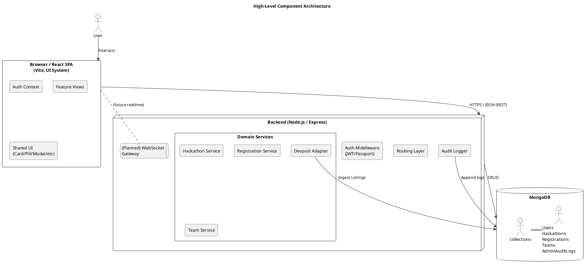
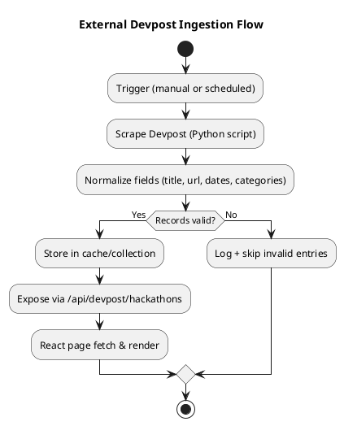
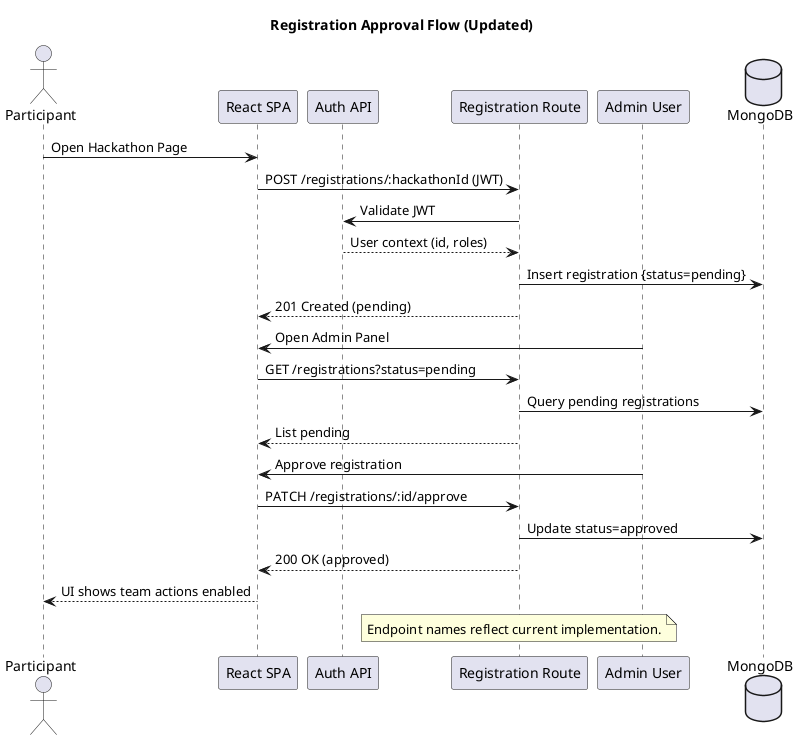
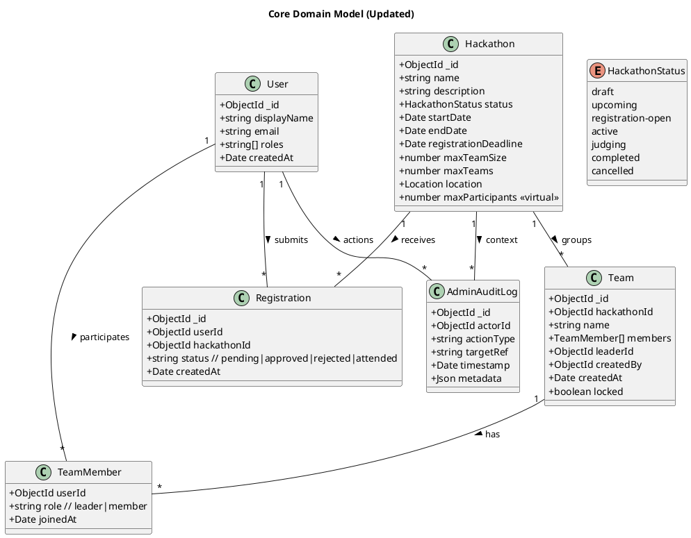
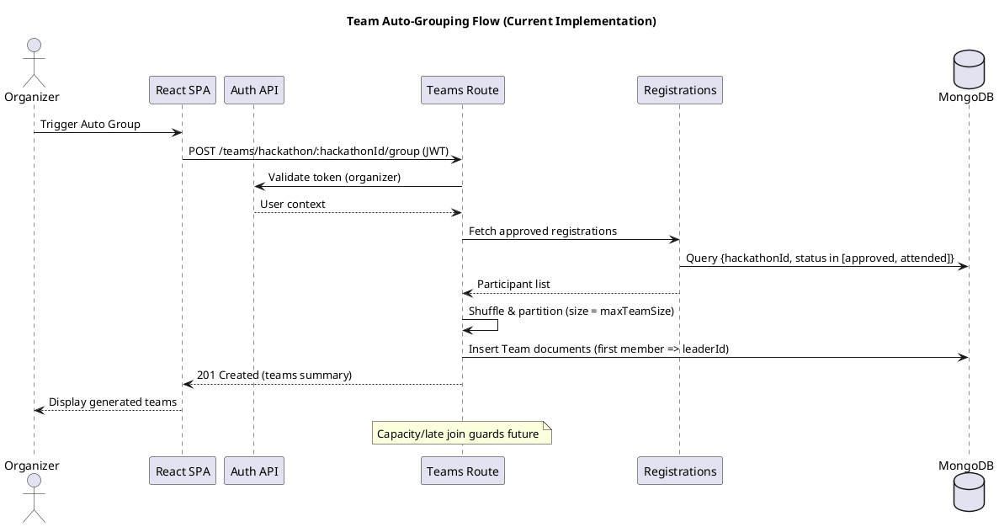
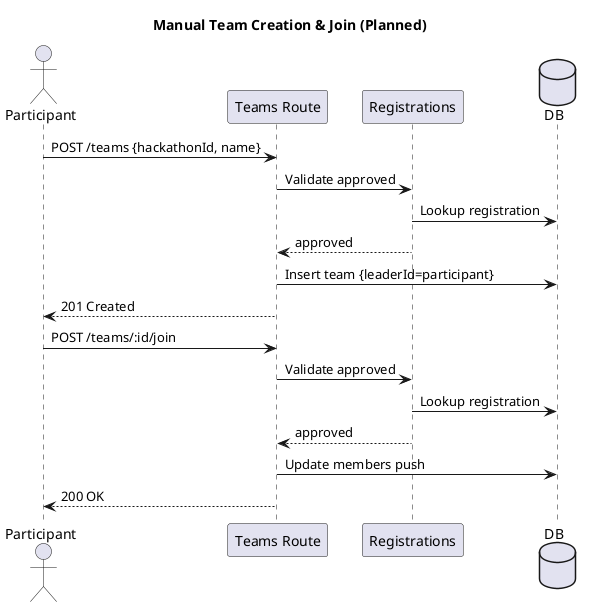

# Hackathon Management Platform

## Abstract

This project is a Hackathon Management Platform designed to streamline the end‑to‑end lifecycle of running and participating in hackathons. Traditional hackathon coordination is fragmented across forms, spreadsheets, chat threads, and ad‑hoc scripts; this system unifies core workflows—event creation, participant registration, team formation, scheduling, submissions, and external discovery—into a cohesive, role‑aware application. It matters because organizers gain operational clarity (reduced manual overhead and faster onboarding), participants receive transparent status feedback (registration state, deadlines, team membership, submission readiness), and the platform establishes a scalable foundation for future judging, analytics, and innovation tracking capabilities.

Key achievements include: a lifecycle‑driven hackathon model (draft → upcoming → registration‑open → active → judging → completed), structured registration with optional approval and capacity enforcement, dynamic team management with support for organizer‑driven or automated grouping, a submission-ready team domain model, and a polished React UI employing a consistent internal design system (Card, Pill, Modal, OrbitProgress, Navigation). Integration with external Devpost listings expands discovery, while modular backend data models (Users, Hackathons, Registrations, Teams, Audit Logs) enable clean separation of concerns and future extensibility (judging rubrics, scoring, certificates, leaderboards). The architecture emphasizes clarity, reusability, and incremental evolution. Overall, the platform delivers a unified, extensible base that transforms hackathon administration from reactive coordination into a structured, insight‑driven process.

## Introduction

### Background

Hackathons have become a mainstream vehicle for rapid innovation, experiential learning, community building, and talent discovery. However, the operational layer behind even a modest event is commonly stitched together from spreadsheets, generic form builders, ad‑hoc email threads, chat rooms, and manual triage—introducing friction, inconsistent participant experience, and data fragmentation. As events scale or diversify (multi‑track, hybrid, judged categories), these improvised workflows produce delays, poor visibility into capacity and engagement, and limited reusability across editions.

### Problem Statement

Existing generic tooling fails to provide a cohesive, lifecycle‑aware system that covers registration gating, approval workflows, capacity constraints, team dynamics, submission pathways, and external discovery integration. Organizers lack real‑time clarity; participants encounter ambiguity around status, deadlines, and team progression; and post‑event insights remain shallow due to scattered data.

### Objectives

1. Provide a unified platform to model and manage the full hackathon lifecycle (draft → completion).
2. Enable structured registration with optional approval and automatic rule enforcement (deadlines, capacity, uniqueness).
3. Support flexible team formation (manual or auto‑grouping) with role semantics (leader vs member).
4. Standardize the submission funnel for projects with extensible metadata (tech stack, links, artifacts).
5. Integrate external hackathon discovery (Devpost) to broaden participant context and value.
6. Establish a clean domain model foundation for future judging, scoring, analytics, and certification modules.

### Scope

In‑scope for the current iteration: core domain models (User, Hackathon, Registration, Team, Submission placeholder), lifecycle state transitions, registration and team management logic, external Devpost listing ingestion, and a reusable UI component layer (Card, Pill, Modal, Navigation, Progress). Deliberately deferred: full judging engine, role request workflows beyond baseline roles, granular notification center, certificate generation, advanced analytics dashboards, and real‑time collaboration/messaging.

### Motivation

By codifying the operational patterns of hackathons into a structured, extensible system, the project reduces organizer cognitive load and participant uncertainty while laying groundwork for richer value: automated scoring pipelines, talent insights, longitudinal event metrics, and plug‑and‑play integrations (sponsor APIs, credentialing, educational badges). The platform’s modular architecture positions it not merely as an event utility but as a strategic layer for sustained innovation ecosystems.

### Expected Impact

Short term: faster event setup, reduced manual coordination, clearer participant journey. Medium term: scalable adoption across multiple events with consistent data integrity. Long term: a foundation for an innovation operations suite supporting benchmarking, outcome analytics, and ecosystem growth.

## Literature Review / Related Work

### Implementation Overview

This section surveys existing hackathon and innovation management ecosystems, adjacent project submission platforms, and enabling tooling patterns considered during design. It highlights capability gaps that shaped architectural and feature decisions for this platform.

### Established Platforms

1. **Devpost** – Dominant project showcase and submission platform for public hackathons. Strengths: large community reach, standardized submission templates, judging workflows for hosted events. Limitations for organizers running private or multi‑phase programs: limited pre‑registration gating logic, constrained team formation guidance, minimal lifecycle state modeling outside submission/judging windows, and reduced flexibility for custom approval or internal analytics.
2. **MLH (Major League Hacking) tools & manual stack** – Many student events rely on a patchwork (Google Forms + Discord/Slack + Airtable/Sheets + Email). While flexible and low barrier, this introduces data fragmentation, manual status reconciliation, and low repeatability across event editions.
3. **Eventbrite / Generic Event Registration** – Optimized for ticketing, attendance, and payment—not for iterative team formation, submission pipelines, or developer‑centric metadata capture (repos, tech stack, deployment links).
4. **Hackathon Starter Kits / Templates (GitHub repos)** – Provide scaffolding for authentication, basic project submission, or scheduling, but rarely offer a cohesive domain model spanning registrations with approvals, dynamic teams, and external discovery ingestion.
5. **Innovation & Idea Management Suites (e.g., IdeaScale, Brightidea)** – Rich evaluation and portfolio analytics but heavyweight for single hackathon execution; configuration overhead and licensing costs misalign with lightweight, iterative community events.

### Capability Gaps Observed

| Need | Typical Gap in Existing Solutions |
|------|-----------------------------------|
| Lifecycle granularity (draft→upcoming→registration→active→judging→completed) | Often simplified to “registration open” + “submission deadline” without intermediary operational states |
| Conditional / approval‑based registration | Generic ticketing or form tools lack rule engines or per‑participant status histories |
| Flexible team orchestration & restructuring | Ad‑hoc via chat; platforms seldom model leader roles, capacity, or late joins cleanly |
| Unified participant journey visibility | Fragmented across email threads, spreadsheets, and chat announcements |
| External listing ingestion (Devpost sync) | Manual copy/paste; no integrated aggregation layer |
| Extensibility toward judging analytics & longitudinal metrics | Either too rigid (fixed schema) or too heavyweight (enterprise suites) |

### Design Influences & Adopted Patterns

* **Domain‑Driven Modeling** – Distinct aggregates (Hackathon, Registration, Team, User, Audit Log) to isolate invariants and enable future bounded contexts (Judging, Scoring, Credentials) without schema churn.
* **State Machines for Lifecycle** – Explicit enumerated states reduce ambiguity and unlock deterministic UI rendering (status badges, time‑left indicators) and guard conditions for mutations.
* **Separation of Read vs Write Concerns (Light CQRS Leaning)** – While not a full CQRS implementation, the API surfaces lifecycle transitions and domain actions explicitly, enabling future event sourcing or projections if analytics deepen.
* **Composable UI System** – Card, Pill, Modal, Tabs, and Progress components encourage consistent semantics for status, grouping, and progressive disclosure.
* **External Data Ingestion Adapter (Devpost)** – Treated as an integration boundary, allowing replacement or expansion (e.g., GitHub trending, Kaggle competitions) without polluting core domain logic.

### Alternatives Considered

1. **Embedding Devpost iFrames / Direct Offloading** – Rejected to retain control over internal registration gating, team mechanics, and enriched participant telemetry.
2. **Extending a Generic Event Platform** – Discarded due to impedance mismatch (ticketing metaphors do not map cleanly to iterative hackathon phases + team semantics).
3. **Monolithic “All‑in‑One” Enterprise Suite Adoption** – Overkill for early iterations; would slow velocity and constrain domain experimentation.
4. **Pure Serverless (Functions + Firestore)** – Considered for rapid prototyping but deferred in favor of clearer relational‑style modeling and future auditability; Mongo document collections paired with explicit domain schemas struck a pragmatic balance.
5. **GraphQL API Layer** – Deferred until a proven need for flexible client querying or multi‑channel consumers. REST endpoints suffice for the current bounded surface.

### Rationale for Chosen Approach

The implemented architecture intentionally sits between ad‑hoc tool chains and heavyweight innovation suites: opinionated enough to encode lifecycle, registration, and team invariants, yet modular enough to extend into judging, scoring, and credentialing without refactors. By abstracting external sources (Devpost) and centralizing participant & team state, the platform creates a durable core for analytics while delivering immediate operational clarity. This balance optimizes for iterative delivery, future extensibility, and maintainability.

### Future Research Directions

* Automated judging rubric modeling & scoring pipelines.
* Recommendation systems for intelligent team formation (skills / interest matching).
* Longitudinal participant skill graph & contribution analytics.
* Integration with credentialing / badge standards (Open Badges, W3C Verifiable Credentials).
* Predictive capacity planning using historical registration conversion data.

## System Design / Methodology

### 1. High-Level Architecture Overview

The platform follows a modular service-within-a-monolith pattern: a single Node.js/Express backend structured into clear domain modules (Auth, Users, Hackathons, Registrations, Teams, External Integrations) and a React (Vite) SPA client consuming REST endpoints over HTTP and a WebSocket channel for real‑time updates (future extensibility). MongoDB serves as the operational datastore with logically separated collections mapping to aggregates. Authentication uses JWT (short‑lived access, refresh extension potential) layered with role/claims evaluation in middleware.



### 2. Component & Responsibility Breakdown

| Layer | Responsibility | Key Elements |
|-------|----------------|--------------|
| UI / Presentation | Render lifecycle state, forms, team dashboards, modals. | React components, shared UI system (Card, Pill, Modal, Tabs, Progress, Table). |
| Client Services | Encapsulate API calls, caching hints, auth context propagation. | `apiClient.js`, feature service modules (auth, hackathons, teams). |
| AuthN / AuthZ | Verify token, resolve user & roles, enforce route/operation policies. | Passport/JWT middleware, role utilities. |
| Domain Services | Implement lifecycle transitions, registration gating, team rules. | Hackathon & Registration logic, team membership invariants. |
| Integration Adapter | External data ingestion & normalization. | Devpost scraper / bridge scripts. |
| Persistence | Consistent schema & validation; query abstractions. | Mongoose (or raw driver) models per aggregate. |
| Observability (future) | Event logging, lifecycle traces, audit expansion. | Audit log collection, potential event stream. |

### 3. Domain Model Summary

The table reflects the current implemented schemas (see `server/models/*.js`). Fields marked (virtual) are computed. Planned / not yet implemented items are annotated.

| Aggregate | Core Fields (abridged) | Invariants / Notes |
|-----------|------------------------|--------------------|
| User | _id, displayName, email, roles[], createdAt | `email` unique; roles drive admin UI & authorization decisions. |
| Hackathon | _id, name, description, status, startDate, endDate, registrationDeadline?, maxTeamSize, maxTeams, location, (virtual) maxParticipants | `status` enum: `draft, upcoming, registration-open, active, judging, completed, cancelled`; `maxParticipants = maxTeamSize * maxTeams`; registration allowed only while `status=registration-open` and before `registrationDeadline` (if set). |
| Registration | _id, userId, hackathonId, status (`pending, approved, rejected, attended`), createdAt | Unique `(userId,hackathonId)`; team membership requires `approved` (or later `attended`); capacity guard counts `approved` & `attended`. |
| Team | _id, hackathonId, name, members[{userId, role, joinedAt}], leaderId, createdBy, createdAt, locked | First member becomes `leaderId`; uniqueness of `members.userId`; auto-group endpoint implemented; manual create/join endpoints planned. |
| AdminAuditLog | _id, actorId, actionType, targetRef, timestamp, metadata | Append-only; routes do not yet persist entries (future audit integration). |

### 4. Hackathon Lifecycle State Machine

Statuses: `draft → upcoming → registration-open → active → judging → completed` plus terminal exception `cancelled`.

Current implementation updates the `status` field directly; a dedicated lifecycle service and full guard enforcement are planned. The `cancelled` status exists in the enum but lacks explicit API transition routes yet.

```plantuml
@startuml HackathonLifecycle
title Hackathon Status State Machine
hide empty description
[*] --> draft
draft --> upcoming : schedule set
upcoming --> "registration-open" : registration window opens
"registration-open" --> active : startDate reached OR manual promote
active --> judging : submissions locked
judging --> completed : scoring archived
active --> completed : fast-close
"registration-open" --> cancelled : admin cancel
upcoming --> cancelled : admin cancel
draft --> cancelled : abandon
active --> cancelled : force stop (edge)
judging --> cancelled : abort (edge)
@enduml
```

### 5. Transition Guard Pseudocode (Updated)

Conceptual (not fully implemented yet) service-level guard logic aligned with current field names.

```javascript
function transitionHackathon(h, targetStatus, ctx = {}) {
  const allowed = {
    draft: ['upcoming', 'cancelled'],
    upcoming: ['registration-open', 'cancelled'],
    'registration-open': ['active', 'cancelled'],
    active: ['judging', 'completed', 'cancelled'],
    judging: ['completed', 'cancelled'],
    completed: [],
    cancelled: []
  };
  if (!allowed[h.status] || !allowed[h.status].includes(targetStatus)) throw new Error('Illegal transition');
  const now = Date.now();
  if (targetStatus === 'registration-open') {
    assert(h.startDate && h.endDate, 'Schedule incomplete');
    assert(now < new Date(h.startDate).getTime(), 'Start already reached');
  }
  if (targetStatus === 'active') {
    assert(now >= new Date(h.startDate).getTime(), 'Not yet started');
    if (h.registrationDeadline) {
      assert(now >= new Date(h.registrationDeadline).getTime() || ctx.force === true, 'Registration window still open');
    }
  }
  if (targetStatus === 'judging') {
    assert(ctx.submissionsLocked === true, 'Submissions not locked');
  }
  if (targetStatus === 'completed') {
    assert(now >= new Date(h.endDate).getTime() || ctx.force === true, 'End date not reached');
  }
  return { ...h, status: targetStatus, updatedAt: new Date() };
}
```

### 6. Team Formation Logic (Simplified)

Objectives: enforce uniqueness, ensure only approved participants join, allow optional leader designation, facilitate future auto-grouping.

```javascript
function addMember(team, user, participantStatus) {
  if (participantStatus !== 'approved') throw new Error('Not approved');
  if (team.members.some(m => m.userId === user.id)) throw new Error('Already on team');
  if (team.locked) throw new Error('Team locked');
  // capacity rule (future): if (team.members.length >= team.capacity) throw new Error('Full');
  const role = team.members.length === 0 ? 'leader' : 'member';
  team.members.push({ userId: user.id, role });
  return team;
}
```

### 7. External Devpost Ingestion Flow

1. Scheduled or manual trigger executes a script (`devpost_scraper.py` / bridge).
2. Fetch latest public hackathons (HTML parsing or API if available).
3. Normalize fields: title, url, platform dates, categories.
4. Store in a lightweight collection or cache layer (optionally time‑boxed TTL for refresh).
5. Expose via `/api/devpost/hackathons` endpoint; UI hydrates card grid.



### 8. Technology Stack & Rationale

| Category | Choice | Rationale |
|----------|--------|-----------|
| Frontend | React + Vite | Fast dev server, modular component ecosystem, tree-shaking. |
| Styling | Tailwind-style utility classes | Rapid composition, consistent spacing & typography tokens. |
| UI System | Custom primitives (Card/Pill/Modal/OrbitProgress) | Enforces semantic reuse & accessible patterns. |
| State Mgmt | React Context (Auth, Socket) | Lightweight for current scope; can evolve to Redux/RTK Query if complexity grows. |
| Backend | Node.js + Express | Familiar, fast iteration, rich middleware ecosystem. |
| Auth | JWT (Bearer) + Passport | Standardized stateless authentication; easy role claims embedding. |
| DB | MongoDB | Flexible document modeling for evolving hackathon schema; natural fit for nested team/member arrays. |
| Scripts | Python (scraping) + Node scripts | Leverage Python parsing libs; keep core app JS-focused. |
| Realtime (planned) | Socket.io | Push lifecycle or team updates; reduces polling. |
| Testing (planned) | Jest / Vitest | Unit + integration test layering for domain logic & components. |
| Diagrams | PlantUML | Consistent, text-based versionable architecture & flow diagrams. |

### 9. Key Design Choices & Trade-offs

| Decision | Benefit | Trade-off / Mitigation |
|----------|---------|------------------------|
| Explicit lifecycle state machine | Predictable UI & validation | Requires maintenance as states expand |
| MongoDB over relational | Schema agility | Must enforce some invariants in app logic |
| Custom UI system vs library (e.g., MUI) | Full control, lean bundle | Higher initial build effort |
| REST first vs GraphQL | Simplicity, lower overhead | Less flexible querying (acceptable now) |
| External ingestion adapter boundary | Pluggable future feeds | Additional transformation code |
| Minimal CQRS (no full event sourcing) | Lower complexity early | Future analytics may need refactor (log events now) |
| Single repo (mono) | Faster context sharing | Potential future need for modular extraction |

### 10. Scaling & Extensibility Path

| Future Concern | Strategy |
|----------------|----------|
| Increased read traffic | Add Redis cache for hot hackathon/team views; HTTP CDN for static assets. |
| Write contention (registrations) | Introduce optimistic concurrency (version field) or queue spikes. |
| Complex judging workflows | Isolate Judging bounded context (service module) with rubric & scoring collections. |
| Audit & analytics | Emit domain events (Kafka/NATS) to analytics processor; build materialized views. |
| Multi-tenant support | Namespace collections or add tenantId field; enforce via middleware. |
| Security hardening | Add refresh tokens, rotation, per-action audit, rate limiting & WAF rules. |

### 11. Methodology & Development Practices

1. Iterative vertical slices: deliver lifecycle + registration + teams end-to-end before advanced judging.
2. Domain-first modeling: name aggregates & invariants early, reduce accidental complexity later.
3. Documentation-as-you-build: keep README & presentation in sync; diagrams live near code.
4. Progressive enhancement: plan real-time + analytics but avoid premature infra (no early Kafka).
5. Clean expansion seams: adapters for external sources; decouple UI from raw API responses with thin mappers if shape drifts.

### 12. Potential Improvements (Backlog Seeds)

* Formal event bus & domain event emission.
* Role delegation & granular permissions matrix.
* Submission metadata schema & validation engine.
* Judge assignment & scoring rubric modeling.
* Notification service (email / websocket / push).
* Pluggable credential/badge issuance.
* Rich analytics dashboard (participation funnels, retention metrics).

---

### 13. Additional Diagrams

#### 13.1 Registration Approval Sequence

This sequence shows the flow from a participant initiating registration through admin approval and eventual team joining eligibility.



#### 13.2 Core Domain Class Diagram

An abstracted structural view of principal domain entities and relationships (multiplicity indicative, not strict ORM syntax).



#### 13.4 Team Auto-Grouping Sequence (Implemented) & Planned Manual Flow

The current implementation provides an organizer-triggered auto-grouping endpoint. Manual team creation/join flows are planned and diagrammed separately for future reference.





The second diagram is aspirational and retained to show intended API evolution.

## Implementation

### Overview

This section documents how the system is actually built: selected library primitives, representative model schemas, critical route handlers, validation & guard logic, frontend composition patterns, and integration adapters. Code excerpts are trimmed for clarity (omissions indicated with `// ...`). Screenshots can be added later under `docs/screenshots/` (placeholders included below).

### Backend Stack & Conventions

* Runtime: Node.js + Express (modular routers under `server/routes/`)
* Persistence: MongoDB via Mongoose models (`server/models/*.js`)
* Auth: Google OAuth (Passport) → signed JWT (HttpOnly cookie) → downstream `verifyJwt` for authorization
* Realtime: Socket event emitter placeholders (registrations) – future Socket.io gateway
* Cross‑cutting: Consistent `authenticateToken` middlewares reading `auth_token` cookie

### Core Domain Models (Excerpts)

`Hackathon` schema (selected fields, virtuals, lifecycle helpers):

```javascript
// server/models/Hackathon.js
const HackathonSchema = new mongoose.Schema({
  name: { type: String, required: true, trim: true },
  description: { type: String, required: true },
  startDate: { type: Date, required: true },
  endDate: { type: Date, required: true },
  status: { enum: ['draft','upcoming','registration-open','active','judging','completed','cancelled'], default: 'draft', type: String },
  maxTeamSize: { type: Number, default: 4, min: 1, max: 10 },
  maxTeams: { type: Number, required: true },
  location: { type: LocationSchema, required: true },
  // ... other fields (prizes, organizer, schedule)
});

HackathonSchema.virtual('maxParticipants').get(function() {
  return this.maxTeamSize * this.maxTeams;
});

HackathonSchema.methods.canRegister = function() {
  const now = new Date();
  return this.status === 'registration-open' && (!this.registrationDeadline || now <= this.registrationDeadline);
};
```

`Registration` capacity + approval tracking:

```javascript
// server/models/Registration.js (excerpt)
RegistrationSchema.index({ userId: 1, hackathonId: 1 }, { unique: true });

RegistrationSchema.pre('validate', async function(next) {
  if (this.isNew) {
    const hackathon = await mongoose.model('Hackathon').findById(this.hackathonId);
    if (!hackathon || !hackathon.canRegister()) return next(new Error('Registration is closed'));
    if (hackathon.maxParticipants) {
      const count = await this.constructor.countDocuments({ hackathonId: this.hackathonId, status: { $in: ['approved','attended'] } });
      if (count >= hackathon.maxParticipants) return next(new Error('Hackathon has reached maximum participant capacity'));
    }
  }
  next();
});
```

`Team` member guard & leader assignment:

```javascript
// server/models/Team.js (excerpt)
TeamSchema.methods.addMember = function(userId, role = 'member') {
  if (this.members.some(m => m.userId.toString() === userId.toString())) {
    throw new Error('User is already a member');
  }
  this.members.push({ userId, role, joinedAt: new Date() });
  if (this.members.length === 1) { this.leaderId = userId; this.members[0].role = 'leader'; }
  return this.save();
};
```

### Selected Route Handlers

Hackathon listing & filtering (public):

```javascript
// server/routes/hackathons.js (excerpt)
router.get('/', async (req, res) => {
  const { status, upcoming, active } = req.query;
  const query = {};
  if (status) query.status = status;
  if (upcoming === 'true') { query.status = { $in: ['upcoming','registration-open'] }; query.startDate = { $gt: new Date() }; }
  if (active === 'true') query.status = 'active';
  const hackathons = await Hackathon.find(query).sort({ startDate: 1 }).lean();
  res.json(hackathons);
});
```

Registration creation (idempotent + capacity enforcement + socket emit):

```javascript
// server/routes/registrations.js (excerpt)
router.post('/:hackathonId', authenticateToken, async (req, res) => {
  const { hackathonId } = req.params;
  const hackathon = await Hackathon.findById(hackathonId);
  if (!hackathon) return res.status(404).json({ message: 'Hackathon not found' });
  if (!hackathon.canRegister()) return res.status(400).json({ message: 'Registration is closed' });
  const existing = await Registration.findOne({ userId: req.user.id, hackathonId });
  if (existing) return res.status(200).json(existing); // idempotent
  const registration = new Registration({ userId: req.user.id, hackathonId });
  await registration.save();
  emitRegistrationCreated(hackathonId, registration); // realtime hook
  res.status(201).json(registration);
});
```

Auto-group participants into balanced teams:

```javascript
// server/routes/teams.js (excerpt)
router.post('/hackathon/:hackathonId/group', authenticateToken, async (req, res) => {
  const hackathon = await Hackathon.findById(req.params.hackathonId);
  if (!hackathon) return res.status(404).json({ message: 'Hackathon not found' });
  const participants = await Registration.getParticipants(hackathon.id);
  // Shuffle + slice into teams of size maxTeamSize respecting maxTeams
  // ... shuffle logic omitted
  // Create team docs with first member -> leader
  // ... persistence & response
});
```

External Devpost ingestion adapter invoking Python script:

```javascript
// server/routes/devpost.js (excerpt)
function runPythonScript(args = []) {
  return new Promise((resolve, reject) => {
    const pythonProcess = spawn(pythonCommand, [scriptPath, ...args]);
    let dataString = '';
    pythonProcess.stdout.on('data', d => { dataString += d; });
    pythonProcess.on('close', code => {
      if (code !== 0) return reject(new Error('Python script error'));
      resolve(JSON.parse(dataString));
    });
  });
}
```

Auth callback finalizes JWT + sets HttpOnly cookie:

```javascript
// server/routes/auth.js (excerpt)
passport.authenticate('google', { failureRedirect: '/auth/failure', session: false })(req, res, next);
// ... inside success handler
const token = signJwt({ sub: dbUser._id.toString(), roles: dbUser.roles, displayName: dbUser.displayName });
setAuthCookie(res, token);
res.redirect(`${process.env.CLIENT_ORIGIN}/?login=success`);
```

### Frontend Composition

Devpost hackathon grid (data fetch, defensive cleaning, status / time-left pill variants):

```jsx
// src/pages/DevpostHackathons.jsx (excerpt)
const fetchHackathons = async () => {
  const response = await fetch('/api/devpost/hackathons');
  const data = await response.json();
  const cleaned = (data.hackathons||[]).map(h => ({
    ...h,
    prizes: typeof h.prizes === 'string' ? h.prizes.replace(/<[^>]*>/g,'') : h.prizes
  }));
  setHackathons(cleaned);
};
```

Shared UI primitives (`<Card/>`, `<Pill/>`, `<Button/>`) enforce consistent spacing & semantic states (e.g., `variant="success|warning|danger|info|primary"`).

### Data Validation & Indexing

Representative indexes improving query paths:

```javascript
// Hackathon: status + startDate for filtering upcoming/active
HackathonSchema.index({ status: 1, startDate: 1 });
// Registration uniqueness
RegistrationSchema.index({ userId: 1, hackathonId: 1 }, { unique: true });
// Team member lookups
TeamSchema.index({ 'members.userId': 1 });
```

### Error Handling & Resilience Patterns

* Graceful Mongo unavailability: hackathon listing returns `[]` if connection errors (see try/catch in `hackathons.js`).
* Idempotency: registration endpoint returns existing document instead of hard error.
* Validation layering: Mongoose pre‑validate (capacity, temporal) + route guard (status, presence).
* Defensive JSON parsing for external Python output; rejects on non‑zero exit codes.
* Minimal leakage of internal errors (generic `Server error` messages with logs server-side).

### Screenshots (Placeholders)

| Feature | Placeholder |
|---------|-------------|
| Dashboard |  |
| Devpost Listing |  |
| Registration Admin |  |
| Team Management |  |

Add images by creating the `docs/screenshots/` directory and placing PNG/JPG assets (ensure they are git‑tracked if size is manageable or use lightweight thumbnails).

### Local Development / Running

```bash
# 1. Install root dependencies
npm install

# 2. (Recommended) Create environment file for server
cp server/.env.example server/.env   # if template exists
# Populate required variables:
# GOOGLE_CLIENT_ID=...
# GOOGLE_CLIENT_SECRET=...
# SERVER_BASE_URL=http://localhost:5000
# CLIENT_ORIGIN=http://localhost:5173
# PORT=5000
# JWT_SECRET=generate-a-secure-random-string

# 3. Start backend (from project root if script defined, else cd server)
npm run server

# 4. Start frontend (Vite dev server, usually on 5173)
npm run dev

# 5. Visit the app
open http://localhost:5173

# (Optional) Python scraping dependencies
pip install -r server/scripts/requirements.txt  # if present
```

### Build & Extensibility Notes

* Clear seams around ingestion (`devpost.js`) allow adding new external sources.
* Virtual + derived properties (e.g., `maxParticipants`) avoid persistent duplication.
* Index strategy anticipates high‑read patterns (filter by status, members, role moderation).
* Route segmentation keeps surface area legible (`auth`, `hackathons`, `registrations`, `teams`, `devpost`).

---

End of Implementation section.

## Conclusion and Future Work

### Summary of Achievements

* Delivered a coherent full‑stack Hackathon Management Platform unifying lifecycle modeling, participant registration, team formation, and external discovery ingestion (Devpost) under a consistent architecture.
* Established an explicit, extensible domain model (Hackathon, Registration, Team, User, AdminAuditLog) with guardrails (state enumeration, capacity enforcement, per‑participant uniqueness) and clearly separated integration boundary.
* Implemented pragmatic operational workflows: registration approval gating, idempotent registration endpoint, auto‑grouping of participants into balanced teams, and derived capacity metrics via virtual fields.
* Built a reusable UI component system (Card, Pill, Modal, Button, Tabs, Table) enabling consistent visual semantics (status, variant mapping, progressive disclosure) and minimized coupling between presentation and domain logic.
* Adopted PlantUML for diagrams across architectural layers (component, lifecycle, sequence, class, ER) ensuring versionable, text‑first documentation integrated directly with source control.
* Provided structured Implementation documentation (models, routes, indexing, error handling, run instructions) to accelerate onboarding and reduce tacit knowledge drift.

### Current Limitations

| Area | Limitation | Impact | Mitigation Path |
|------|------------|--------|-----------------|
| Judging & Scoring | No rubric engine, no judge assignments | Cannot finalize competition workflows | Add Judging bounded context + scoring collections |
| Submissions | Basic placeholder; no file artifact mgmt | Limited richness of project evaluation | Introduce managed object storage links + validation schema |
| Realtime | Socket event wiring stubbed | UI must poll for some updates | Implement Socket.io gateway & event channels (registrations, teams, lifecycle) |
| Auth Hardening | No refresh token rotation / rate limiting | Session longevity & brute force risk | Introduce refresh token store + rate limit middleware |
| Analytics | No event sourcing / metrics pipeline | Limited longitudinal insights | Emit domain events to Kafka/NATS → materialized views |
| Multi‑Tenancy | Single logical tenant | Cannot easily host multiple organizations | Add tenantId scoping + composite indexes |
| Access Control | Coarse roles only (participant, organizer) | Hard to express granular permissions | Role matrix + per‑action policy registry |
| Testing | Lacks automated unit/integration suite | Higher regression risk | Add Vitest/Jest + supertest + model contract tests |
| Deployment | No container/Docker orchestration docs | Harder reproducible infra | Provide Dockerfile + docker-compose (Mongo + App) |
| Performance | No caching or read replicas | Potential latency under load | Introduce Redis cache + read scaling strategy |

### Extension Opportunities

1. Judging & Evaluation Layer

* Rubric definition (criteria weights, scoring scales)
* Judge assignment algorithm (balanced load / expertise matching)
* Score aggregation & normalization (z‑scores, percentile rank)

1. Enhanced Submission Ecosystem

* Structured metadata schema (tech stack taxonomy, license, deployment type)
* Artifact validation (URL reachability, repository activity checks)
* Optional IP / licensing consent workflows

1. Intelligent Team Formation

* Skill & interest vectorization from registration fields
* Recommendation engine for suggested teammates (cosine similarity / clustering)
* Late‑join balancing heuristics to avoid underpowered teams

1. Analytics & Insights Platform

* Event emission (registration.created, team.joined, submission.finalized)
* Time‑to‑approval, retention, conversion funnel dashboards
* Cross‑event participant graph (skills trajectory, recurring contributors)

1. Credentialing & Recognition

* Badge issuance (Open Badges spec) for roles, milestones, outcomes
* Verifiable credential export (W3C VC) for winning teams / participation

1. Security & Compliance

* Audit log enrichment (before/after diffs, IP, user agent)
* Role escalation workflows with multi‑party approval
* Secrets scanning & dependency vulnerability CI gates

1. Scalability & Ops

* Docker + Compose baseline → optional Kubernetes (horizontal scaling)
* Structured configuration (12‑factor env parity) & health probes
* Rate limiting + adaptive backoff for ingestion tasks

1. Extensible Integration Layer

* Additional sourcing adapters (GitHub Issues for challenge ideas, Kaggle competitions, ML dataset leaderboards)
* Webhook outbound events for sponsor platforms
* Pluggable scoring plugins (e.g., automated static analysis metrics)

### Strategic Impact

The implemented foundation transforms hackathon administration from ad‑hoc tooling into an explicit, evolvable platform. By internalizing lifecycle semantics and surfaces for participant/team state, the system becomes a substrate for higher‑order capabilities (adaptive judging, learning analytics, credential portability). Each proposed extension leverages existing seams (adapters, virtual fields, state machine) rather than requiring invasive refactors—validating the upfront architectural discipline.
